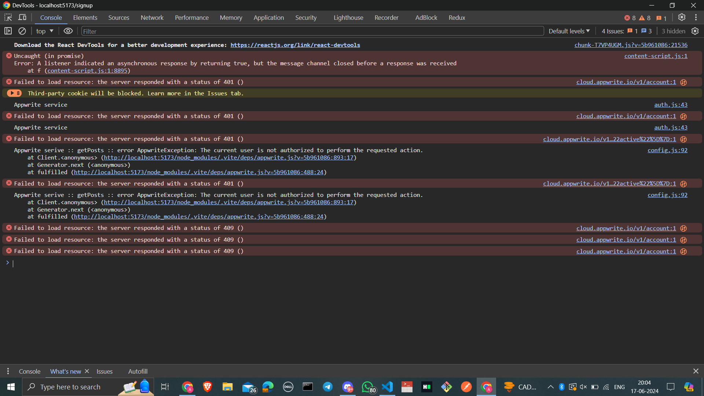

# Project Issue Documentation

## Introduction

This is the issues that i faced while developing a project.
 
## Issue 1 :  CORS - cross origin resource sharing 

Issues that i have faced :


the cros error occured when because we are trying to access the  appwrite services that are present on the other domain or another url and the frontend is on other url.

That being said you are trying to access the responce of the requests that is on the another domain or url while present on the another domain at that time the CORS Error occurs.

to resolve this error you need to set a platform on the appwrite -> applicatoin -> Integration -> add platform -> web -> give platform name -> Hotsname (as *localhost so that all the url being allowed.)


## Issue 2: the return statement must be accurate

The issue occured in the return catch block in getposts method which is in the auth.js file:



```javascript

// the wrong code is
async getPost(slug){
        try {
            return await this.databases.getDocument(
                conf.appwriteDatabaseId,
                conf.appwriteCollectionId,
                slug
            
            )
        } catch (error) {
            console.log("Appwrite serive :: getPost :: error", error);
            return false // the return statement must be the null because the getposts is not a boolean function.
        }
    }


// write code is
async getPost(slug){
        try {
            return await this.databases.getDocument(
                conf.appwriteDatabaseId,
                conf.appwriteCollectionId,
                slug
            
            )
        } catch (error) {
            console.log("Appwrite serive :: getPost :: error", error);
            return null  // corrected 
        }
    }

```


## Issue 3: error in PostForm

```javascript
// error:-
const userData = useSelector(state => state.state.userData);

// corrected:-
const userData = useSelector((state) => state.auth?.userData);

```


